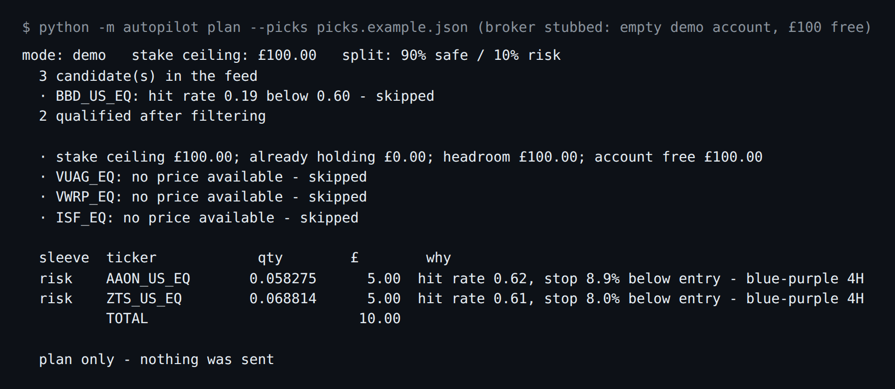
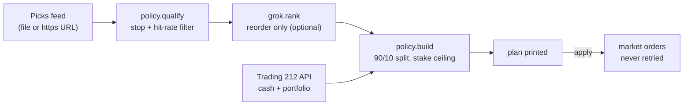

# t212-autopilot

Connects a Trading 212 account to a picks feed you publish and buys on a fixed 90/10 split: 90% into broad ETFs, 10% following your signal, with an optional Grok ranking that cannot add, size or stop anything. Demo account by default.



*`python -m autopilot plan` run against `picks.example.json`, with the broker client replaced by a stub (an empty demo account with £100 free) so nothing touches Trading 212. The 0.19 hit-rate pick is filtered out. The three ETFs are skipped because the account holds none of them and there is no price for them. That is a real limit, covered under [Status](#status-limits-and-real-results).*

  

**This is not financial advice, and it is not a proven strategy.** It is shared as a reference for wiring a signal to a broker safely. Read [Status, limits and real results](#status-limits-and-real-results) before you point it at real money.

## What it does

- **Plans before it buys.** `plan` prints every order and why, and sends nothing. `apply` prints the same plan first. On a live account it refuses unless you also pass `--yes-live`.
- **Splits the stake 90/10.** The safe sleeve is split equally across your ETF list. The risk sleeve is split across up to 4 qualified picks (`autopilot/policy.py`).
- **Treats the stake as a ceiling.** What it already holds plus what it is about to buy must stay under `AUTOPILOT_STAKE_GBP`, whatever else is in the account. A plan that would breach it is refused.
- **Filters picks mechanically.** A pick with no usable stop is skipped. A pick below `AUTOPILOT_MIN_HIT_RATE` (default 0.60) is skipped.
- **Lets Grok reorder, nothing more.** The ranking it returns is intersected with the approved list, so a made-up ticker is dropped (`autopilot/grok.py`). With no key, picks keep the feed's order.
- **Never retries an order.** Reads back off and retry. A failed `POST` is reported and the run moves on, because Trading 212 has no idempotency key (`autopilot/t212.py`).
- **Serves a remote MCP endpoint** with `cash`, `positions`, `plan` and `apply_demo` tools. There is no tool that buys on a live account (`autopilot/mcp.py`).

## Quick start

You need Python 3 (checked here with 3.12) and a Trading 212 API key. Start with the **demo** account.

```bash
git clone https://github.com/casareanderson/t212-autopilot.git
cd t212-autopilot
pip install -r requirements.txt     # httpx is the only dependency
cp .env.example .env                # fill in T212_KEY and T212_SECRET
set -a; source .env; set +a
python -m autopilot check
```

Success looks like this: `check` prints the account id, currency, free and invested cash, then `ok - credentials reach this account`. With no key set, it exits 1 and tells you what is missing:

```
  ✗ T212_KEY and T212_SECRET must both be set (auth is HTTP Basic - the key is the username, the secret is the password)
```

### Getting a Trading 212 key

1. In the Trading 212 app or web dashboard: **Settings > API (Beta) > Generate API key**.
2. Generate it **on the account you mean to trade**. A live key returns `401` on the demo host and a demo key returns `401` on the live host. That 401 almost always means the wrong environment, not a bad key.
3. Give it read scope, plus order placement if you will use `apply`. `check` and `plan` only need read.
4. Auth is HTTP Basic: the key is the username, the secret is the password. A key's first 8 characters are the account number, which is how `check` warns you about a mismatch.

## Usage

```bash
python -m autopilot check                                 # credentials and account
python -m autopilot plan  --picks picks.json              # what it would do. Never writes.
python -m autopilot apply --picks picks.json              # demo: places orders
python -m autopilot apply --picks picks.json --yes-live   # live: the flag is required
```

`--picks` takes a local path or an https URL.

### The picks feed

A JSON list, one object per candidate. This repo deliberately has **no scanner**: what decides what to buy and what buys it can be replaced separately.

```json
[{"ticker": "AAON_US_EQ", "symbol": "AAON", "entry": 85.80, "stop": 78.19,
  "target": 94.38, "hit_rate": 0.62, "note": "blue-purple 4H"}]
```

- `ticker` is the **broker's** ticker, not the exchange symbol.
- `stop` is required. A pick without a stop below its entry is skipped.
- `hit_rate` is your own measured hit rate for that kind of setup.

### Running it for someone else (remote MCP)

```bash
python -m autopilot new-token          # mint a token for one customer
# add them to tenants.json (never commit this file):
# {"tok_...": {"name": "Alex", "t212_key": "...", "t212_secret": "...",
#              "mode": "demo", "stake_gbp": 250, "safe_share": 0.9}}
AUTOPILOT_TENANTS=tenants.json python -m autopilot serve --port 8790
```

In an MCP client such as Grok, add a remote server with your URL and the header `Authorization: Bearer tok_...`. The customer's broker key never appears in a URL. It is looked up server-side from the token, and tokens are compared in constant time.

| Tool | What it does |
|---|---|
| `cash`, `positions` | Read only |
| `plan` | Computes the 90/10 plan from an https feed URL and returns it. Writes nothing. |
| `apply_demo` | Places orders **on the demo account**. Refuses if the tenant is set to live. |

Over the CLI, buying live takes a person typing `--yes-live`. Over MCP there is no live buy at all, so a conversation that drifts cannot spend real money. If you run this for other people, publish a plain disclaimer and check whether doing so needs regulatory cover where you are. This README cannot answer that.

## Configuration

Set in the environment (see `.env.example`):

| Variable | Default | What it does |
|---|---|---|
| `T212_MODE` | `demo` | `demo` or `live` |
| `T212_KEY`, `T212_SECRET` | none | Trading 212 API key and secret (HTTP Basic) |
| `AUTOPILOT_STAKE_GBP` | `100` | Ceiling on everything this tool holds and buys, in GBP |
| `AUTOPILOT_SAFE_SHARE` | `0.90` | Share of the budget for the ETF sleeve |
| `AUTOPILOT_SAFE_TICKERS` | `VUAG_EQ,VWRP_EQ,ISF_EQ` | ETFs for the safe sleeve, split equally |
| `AUTOPILOT_MAX_RISK_POSITIONS` | `4` | Most picks bought in one run |
| `AUTOPILOT_MIN_HIT_RATE` | `0.60` | Picks below this hit rate are skipped |
| `GROK_API_KEY` | none | Optional. Turns on Grok ranking. |
| `GROK_MODEL` | `grok-4-latest` | Model used for ranking |
| `AUTOPILOT_TENANTS` | none | Path to `tenants.json` for `serve` |

## How it works



```
autopilot/
├── cli.py       # check / plan / apply / serve / new-token
├── config.py    # every setting, read from the environment, demo by default
├── picks.py     # loads the feed; only public https URLs over the network
├── policy.py    # qualify + build: the 90/10 split and the stake ceiling
├── grok.py      # optional ranking, intersected back with the approved list
├── t212.py      # Trading 212 client: reads retry, orders do not
├── mcp.py       # remote MCP server (JSON-RPC over HTTP, standard library only)
└── tenants.py   # bearer token -> customer config, constant-time compare
picks.example.json
.env.example
```

## Status, limits and real results

**Nothing in this repo measures returns.** There is no backtest and no trade log here. The numbers below come from the separate, private system this was extracted from, measured on 7 September 2026. They are quoted because they explain the defaults, not as a forecast.

| Signal | Sample | Result |
|---|---|---|
| Daily scan picks | 213 graded picks | −0.187R average, 43% win rate |
| 4H "blue/purple" pattern | 10 resolved setups | +1.93% average, 5 winners |

- The pattern's positive average comes from **one trade**. Without it, the same ten setups average **−1.17%**.
- A first measurement said +9.5% because setups that expired were never given an exit price. Priced properly, all four expiries were losses of −6.1% to −12.6%.
- A stop-loss did not help. Replayed against the real 4-hour bars: no stop +1.93%; −5% stop −1.29% (7 of 10 stopped out); −7% +0.99%; −10% +1.01%.
- Earlier LLM-driven trading flows in the same system showed a realised loss of **£424** on the Trading 212 demo account (measured 14 July 2026) and were removed. That is why the model here only reorders.

So the 10% risk sleeve and the demo default are what those numbers support. Stay on demo until your own feed shows a positive result on a sample you would defend.

Known limits, from the code:

- **The ETF sleeve needs a price it does not have.** Trading 212's public API has no quote endpoint, so `cli.py` prices ETFs only from positions you already hold. On an account that holds none of them, the 90% sleeve buys nothing and only the risk sleeve is bought, as in the screenshot above. Seed the ETFs by hand first, or add a price source.
- **Risk-sleeve prices come from the feed.** A pick you do not hold is sized at the feed's `entry`, which may be stale.
- **Market orders only.** No limit orders, and no selling. Exits and stops are not placed on the broker; `stop` is used only to qualify a pick.
- **`serve` speaks plain HTTP.** Put it behind a TLS reverse proxy before exposing it.
- **No tests** ship in this repo.

## Licence and credits

MIT, see [LICENSE](LICENSE). Uses [httpx](https://www.python-httpx.org/) (BSD-3-Clause). Trading 212 and Grok are third-party services with their own terms; you need your own accounts.
